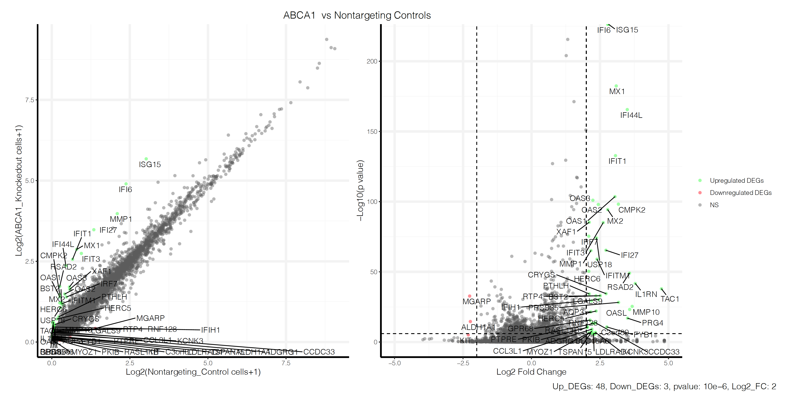
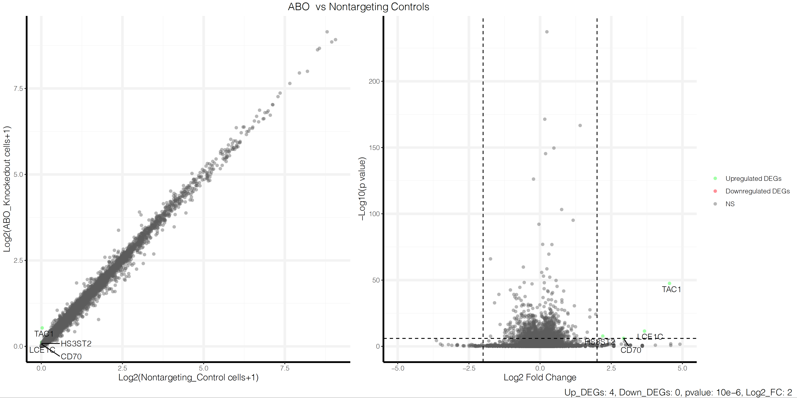
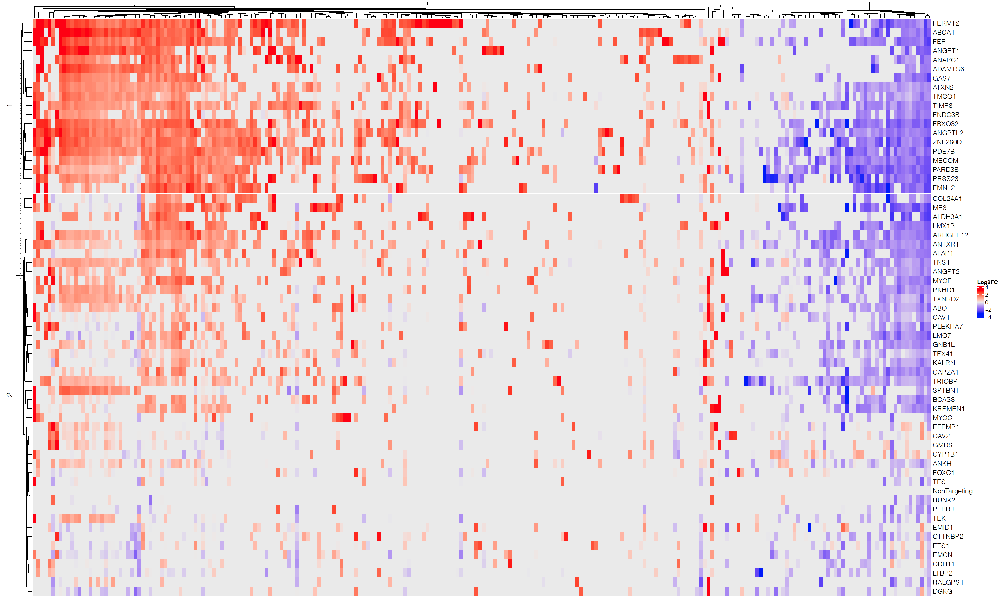
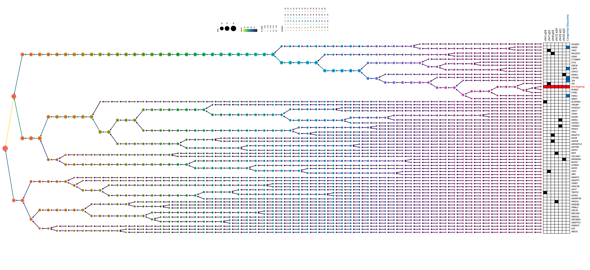

## CROPseq_scRNAseq
This repository contains the scripts of generating DEG figures and processing relative expression Data for the clustering. 
The expression [*.tsv](tsv_files/) files were generated based on [CROP-seq](https://github.com/powellgenomicslab/CROP-seq).

### Generate DEG files
For each gene knockout group, the differentially expressed genes(DEGs) were selected with log2 fold change >2 and pval<10e-6,then a scatter plot and a volcano plot were generated to show the DEGs. ([Scatter_and_Volcano_plots_for_DEGs.R](R/Scatter_and_Volcano_plots_for_DEGs.R))

Examples ABCA1 knockout group and ABO knockout group: 

The DEGs of each groups were filtered out and combined, together with the log2FoldChange values of these DEGs of each group were filtered out and combined. The log2FoldChange values of NonTargeting group were set to 0, also, the log2FoldChange values of DEGs with pval<10e-6 were set to 0. 
[Relative_expression_DEGs.R](R/Relative_expression_DEGs.R)

The heatmap displays the log2FoldChange value of each DEGs of each groups compared to the nontargeting groups.

The cluster tree displays how the groups are clustered using hierarchchical clustering method. Note: The ward.d2 belongs to agglomerative clustering, which considers each data point as its own cluster and merges them together into larger groups from bottom.

